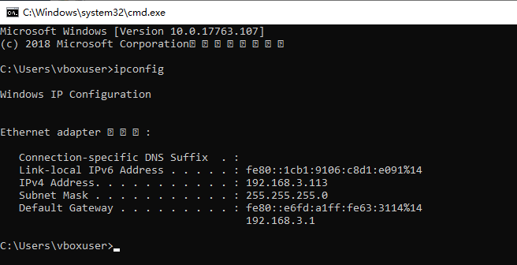
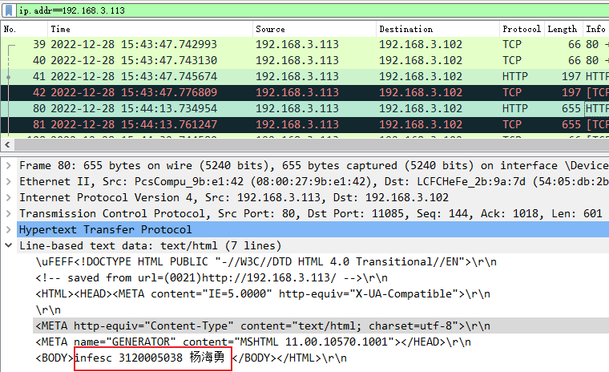
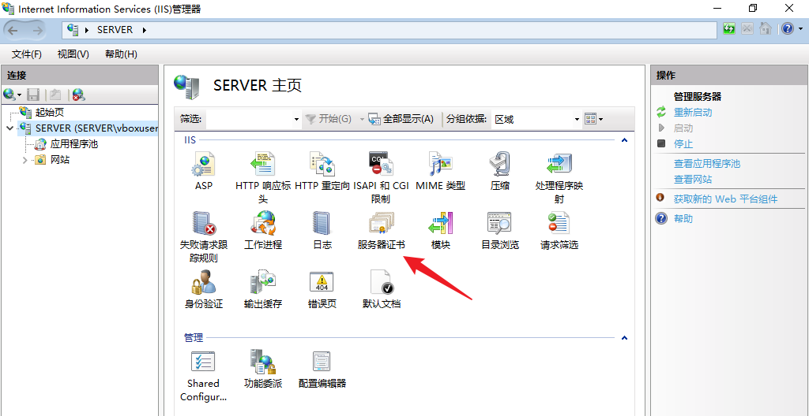
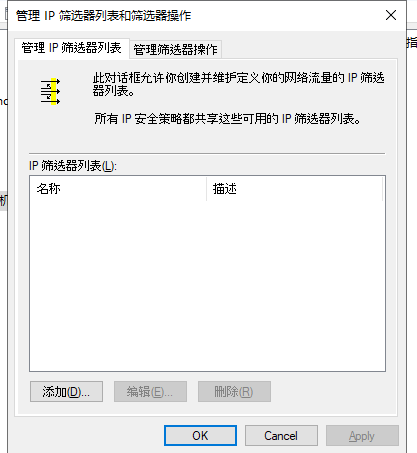
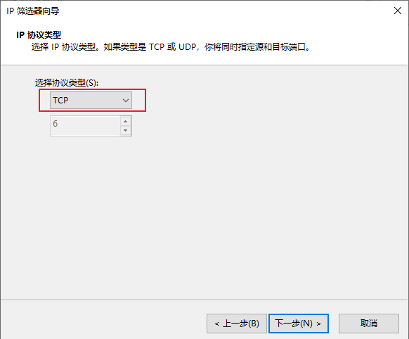
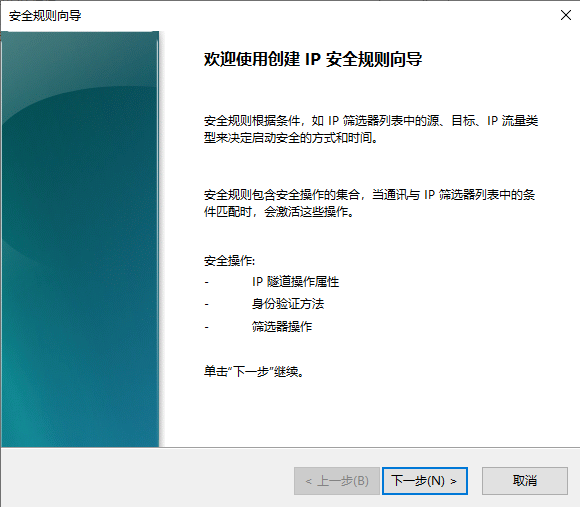
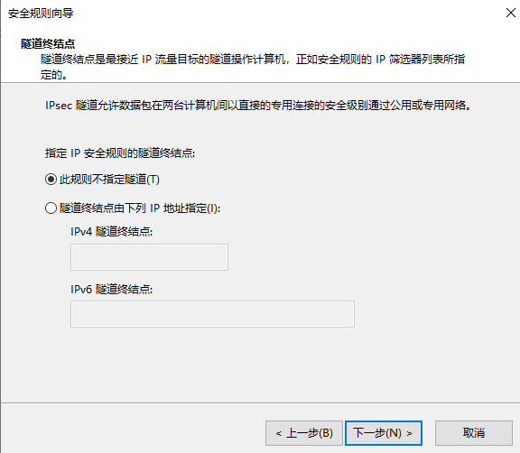
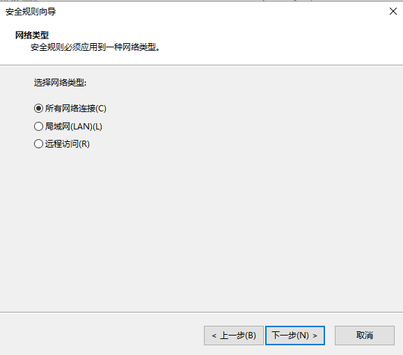
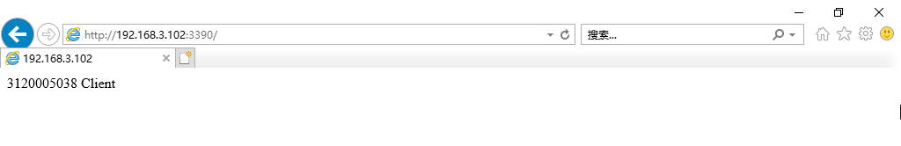

# 实验前提

这里使用一个主机，一个虚拟机，一个是用户端，一个是服务器端。

用户端的IP为192.168.3.102，服务器的IP为192.168.3.113

用户端的系统为windows 10，服务器端的系统为WindowsServer 2019

#  SSL配置

## 查看ip地址

### 客户端ip

### 服务器端ip

## 安装配置IIS服务器

配置服务器，打开IIS管理器

新建网站：

配置网站：

服务器的目录下放置index.html文件

使用浏览器浏览新建网站

## 未启用SSL协议

抓包结果，可以看到明文数据

# PKI

### 安装证书服务

进入服务器管理 安装证书服务

加入域并且安装web服务器

### 创建根证书

配置服务器证书信息

配置私钥加密算法，选择MD5或默认

CA名称设置

有效期设置：

默认点击下一步

Web服务器申请证书

申请证书

下一步输入输出文件目录

### 创建服务器网站证书

在服务器输入http://192.168.3.113/certsrv/，进入证书申请服务，点击申请证书

点击高级证书申请

点击使用base64编码的CMC

打开保存的证书文件，把里面内容复制粘贴进去，点击提交

提交成功

### 证书签发启用SSL

打开管理工具-证书颁发机构

颁发证书：

挂起的申请右侧，选中申请右击所有任务--颁发

通过颁发的证书可以看到证书已颁发

### 证书安装

下载证书

访问http://localhost/certsrv/,查看挂起的证书申请的状态

点击申请证书

选择Base64编码，下载证书

**IIS完成证书申请**

管理工具--IIS--选中服务器--在右侧双击进入服务器证书，点击右侧完成证书申请

选择上面步骤保存的证书文件

成功完成证书申请

## 启用SSL协议

新建网站,选用创建的证书

打开WireShark进行抓包分析

可以看到数据都经过了加密

# IPSec设置

## 创建IPSec规则

打开本地安全策略

首先要打开本地安全策略，可以通过以下几种方法打开
1、开始---运行---输入“secpol.msc”---回车
2、开通---控制面板---管理工具---本地安全策略

 右击“IP安全策略，在本地机器 ”--->“管理IP筛选列表和筛选器操作”

添加IP筛选器

填写名称，点击添加

点击下一步

选择一个特定的IP地址或子网

目标IP地址设为“我的IP地址”

IP协议类型-选择TCP协议

IP协议端口-设置 从任意端口到端口8888

完成IP筛选器向导

完成创建IP筛选器

切换到管理筛选器操作，点击添加

打开筛选器操作向导，点击下一步

填写名称，点击下一步

由于本次是通过IPSec协议的设置来阻止通信，所以选择 阻止

完成筛选器操作向导

 右击“IP安全策略，在本地计算机 ”--->创建IP安全策略

打开IP安全向导

填写IP安全策略名称，点击下一步

点击下一步

完成IP安全策略向导

在弹出新窗口，点击添加

打开安全规则向导

点击下一步

默认直接下一步

选择新建的IP筛选器

选择新建的筛选器操作

完成安全规则向导

完成上述操作后，此时还没有指派策略

## 服务器端配置IPSec

新建一个使用端口3389的网站(操作同上，过程略)

访问情况：主机成功访问

通过WireShark抓包分析，可以看到服务器端有响应

### 服务器端

### 启用IPSec

右键点击“阻止ip访问”，选择“分配”

客户端无法访问网站,证明IPSec配置有效

## 客户端配置IPSec

新建一个使用端口3390的网站（过程同上）

配置IP安全策略、配置IP筛选器、配置筛选器操作（过程同上）

### 未启用IPSec

客户端未配置IPSec，服务器端成功访问网页

使用WireShark抓包分析，可以看到客户端有响应

### 启用IPSec

客户端启用IPSec配置

访问网站

抓包分析

可以看到服务器端连续发了3个TCP请求包给客户端，客户端都没有响应，证明IPSec配置有效