# 信息安全概论作业

## [第一次作业](Git基本操作学习报告.md)

## [第二次和第三次作业](信息安全相关事件.md)

## 异或算法

### 项目运行

1. 下载xinan文件夹下的代码
2. 双击打开YiHuo类

### 实现的功能

- 对任意数据文件类型进行加密，解密

- 可以使用任意打印符号作为密钥进行加密，解密
- 实现加解密后的文件保存

### 加解密操作流程

#### 1.加密

1. 选择加密操作
2. 输入密钥
3. 输入加密的文件路径
4. 输入加密后文件的保存路径

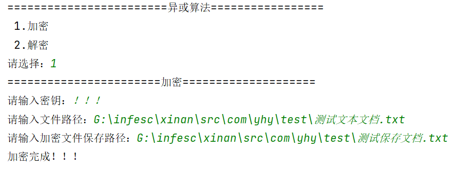

#### 2.解密

1. 选择解密操作
2. 输入密钥
3. 输入解密文件的路径
4. 输入解密后的文件保存路径

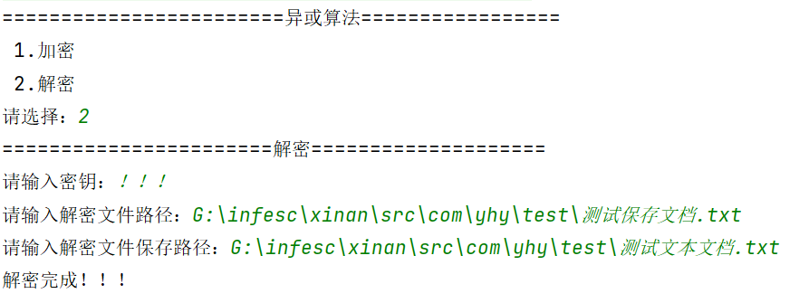

## 古典密码算法

本作业在完成基本作业前提下，增加了友好的图形化界面，优化使用体验。支持Caesar、Playfair、Hill等加密算法的使用。

### 项目运行

1. 下载xinan文件夹下的代码
1. 双击打开运行Menu类即可使用

### 实现的功能

- **Caesar**
  - 加密（显示加密结果）
  - 解密（显示解密结果）
  - 加密前后字符频率统计

- **Playfair**
  - 加密（显示加密矩阵及结果展示）
  - 解密（显示解密结果（格式化后的明文））
  - 加密前后字符频率统计

- **Hill**
  - 加密（显示加密结果，显示加密矩阵）
  - 自定义加密矩阵

### 操作手册

#### 1.操作界面

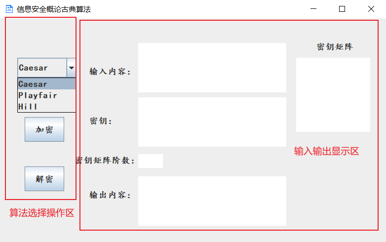

本作业分为**算法选择操作区**和**输入输出显示区**

- 算法选择区：选择不同算法进行加密或解密操作
- 输入输出显示区：主要用于输入内容（包括明文、密文）、密钥输入和结的果输出展示

#### 2.Caesar算法

##### 2.1 加密

测试实例：

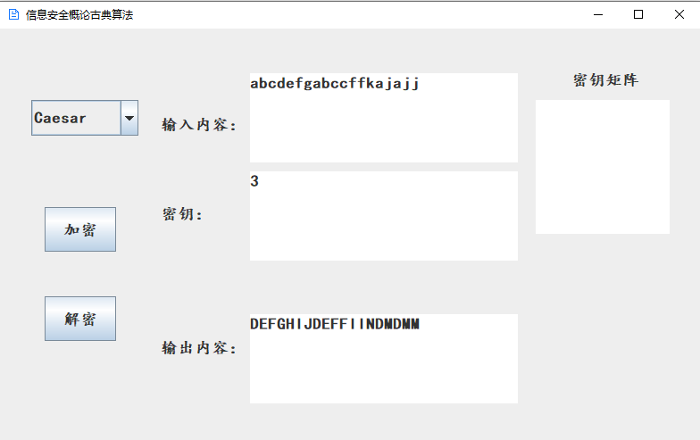

字符频率统计：

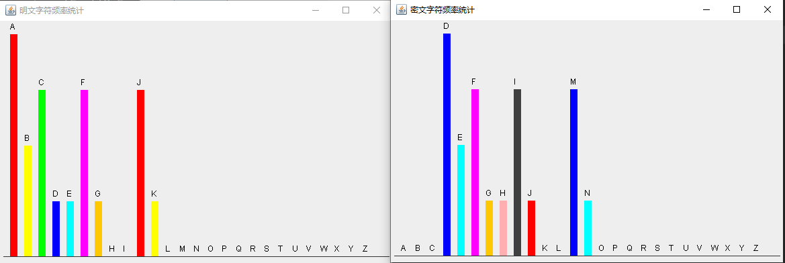

##### 2.2 解密

测试实例：

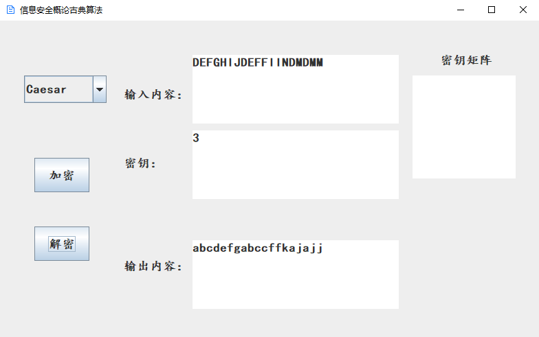

#### 3.Playfair算法

##### 3.1加密

测试实例：

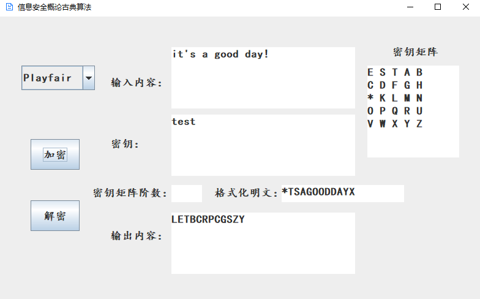

字符频率统计：

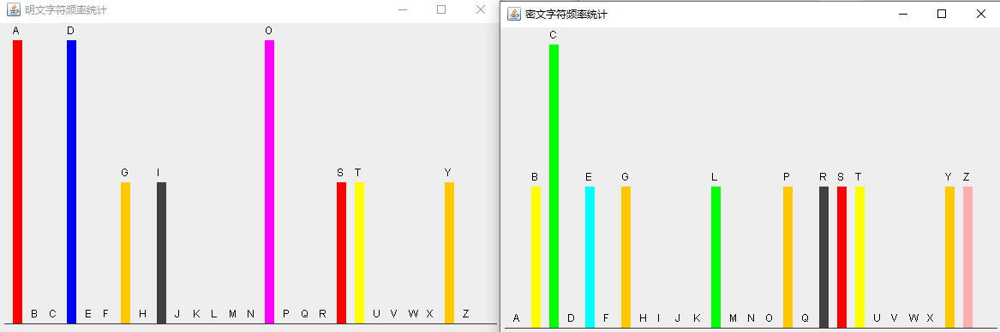

###### 3.2 解密

测试实例：

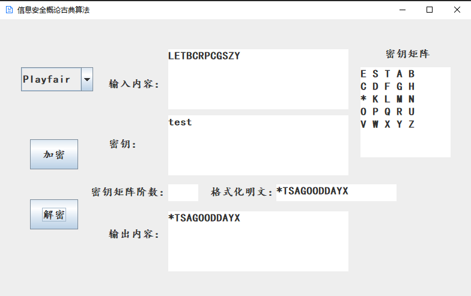

#### 4.Hill算法

##### 4.1 加密

测试实例：

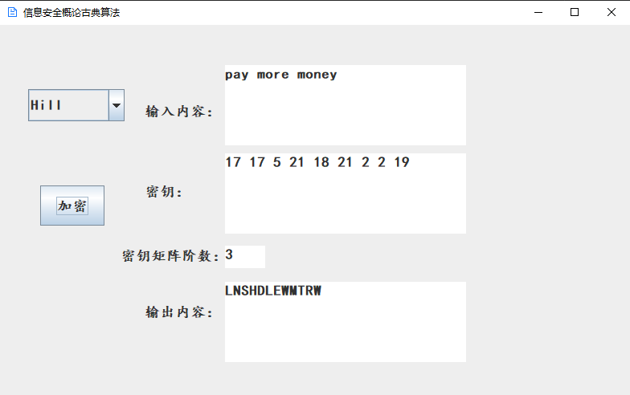

字符频率统计：

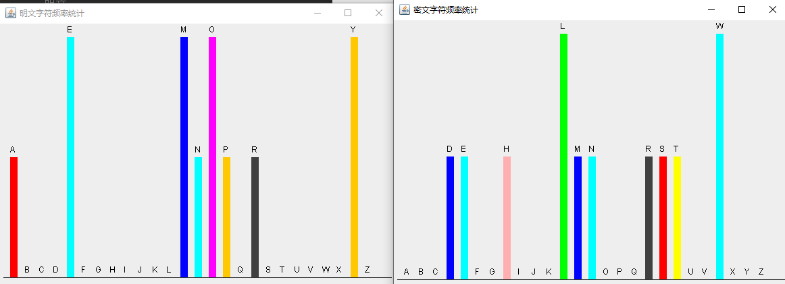

## DES算法

### 项目运行

- 下载xinan文件夹中的文件，双击打开运行Des类

### 实现功能

1. 给定某个Sbox的输入差分情况下，计算所有输入对和所有Sbox输出差分的分布情况 
2. 统计DES算法在密钥固定情况，输入明文改变1-64位时。输出密文位数改变情况。 
3.  统计DES算法在明文固定情况，输入密钥改变1-64位时。输出密文位数改变情况。 

### DES算法测试

- DES算法默认加密明文为：1111111111111111
- 默认密钥为：1111111111111111

**操作界面：**

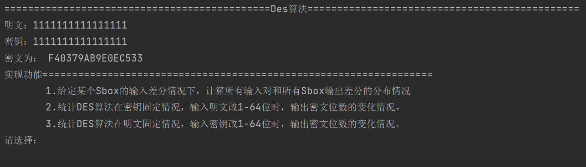

#### 1.给定某个Sbox的输入差分情况下，计算所有输入对和所有Sbox输出差分的分布情况

1. 选择功能 ’1‘
2. 指定输入差分 
3. 选择指定S盒

**运行结果：**

实例1：输入差分 101101 指定S盒s1

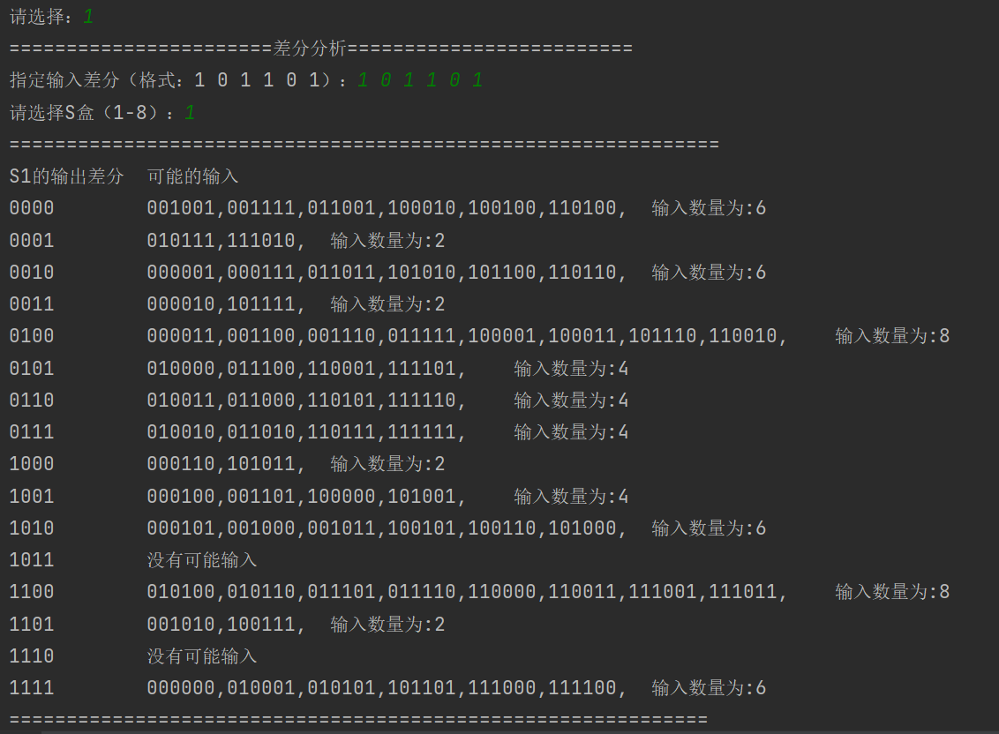

实例2： 输入差分 100101 指定S盒s2

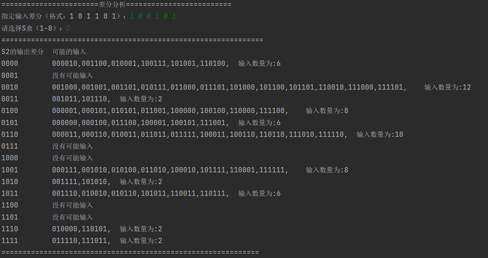

#### 2.统计DES算法在密钥固定情况，输入明文改1-64位时，密文位数的变化情况。

- 选择功能 ’2‘

**运行结果：**

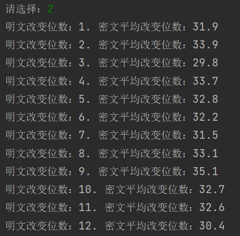

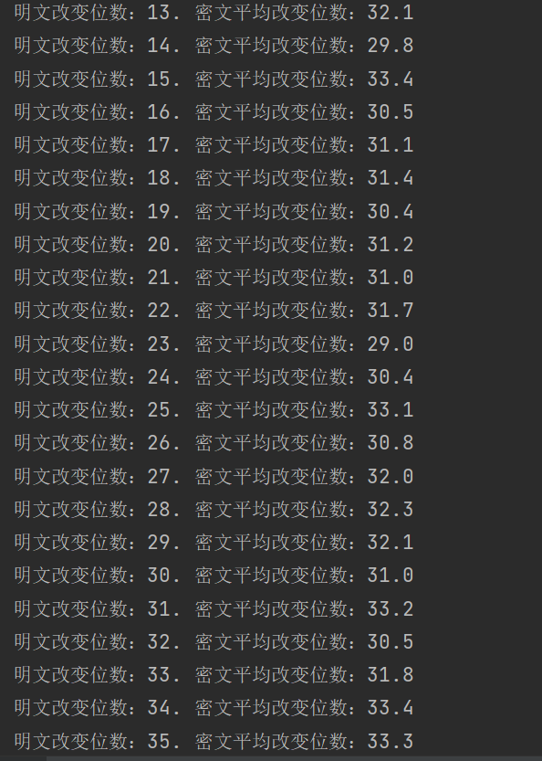

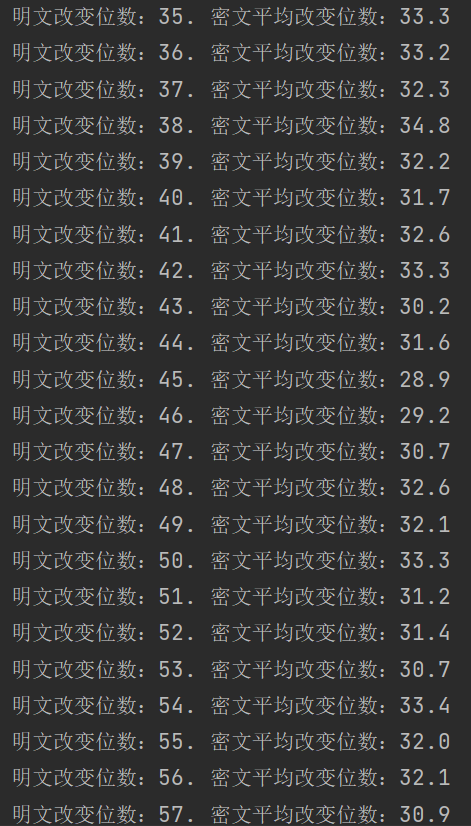

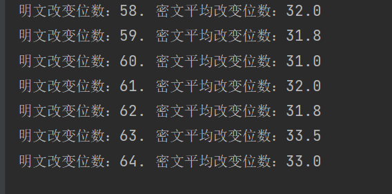

#### 3.统计DES算法在明文固定情况，输入密钥改1-64位时，密文位数的变化情况。

- 选择功能 ’ 3 ‘

**运行结果：**

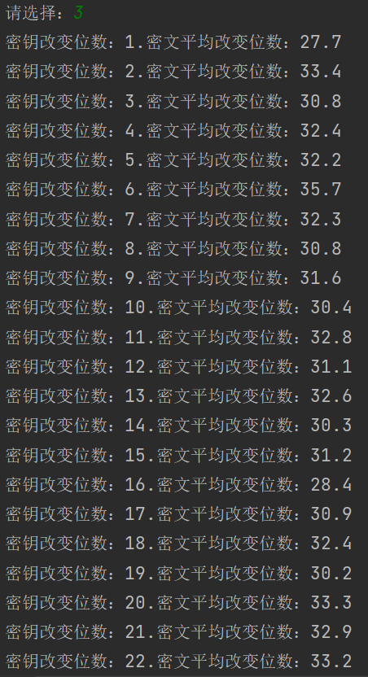

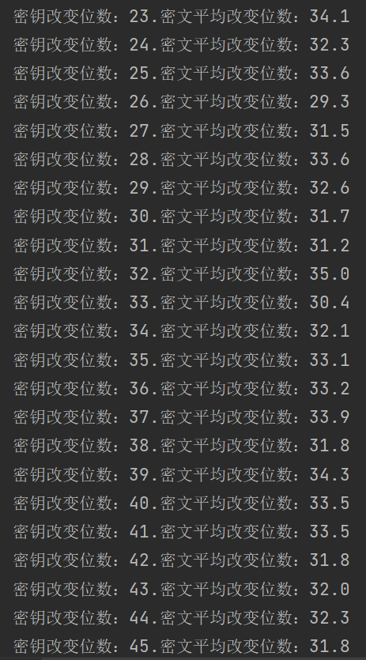

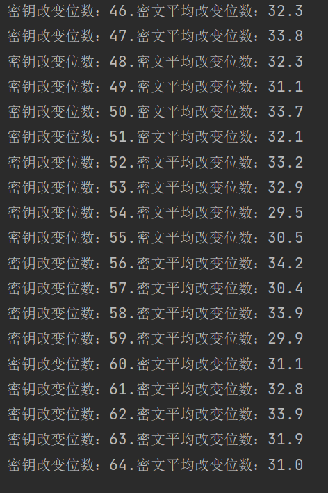

## DH 密钥协商协议

​	本作业按提示编写完成DH密钥协商协议作业要求，同时还增添了自动列举素数p的生成元的功能，使操作更加简便

- **DH密钥协商协议思路**

1. 选择一个质数`p` 及一个`p`的生成元`g`。
2. A 随机选择一个 [1,p-1] 范围内的数`x`，计算 `X`= g^x^ mod p, 并将结果发送给B。
3. B 随机选择一个 [1,p-1] 范围内的数`y`，计算 `Y` = g^y^ mod p, 并将结果发送给A。
4. `k` = `Y`^x  mod `p`= `X`^y  mod `p`

#### 项目运行

- 下载xinan文件夹中的文件，双击打开运行DH类

#### DH密钥协商协议测试

- 实例1 : 素数 `p`： 13  p的生成元`g`： 2

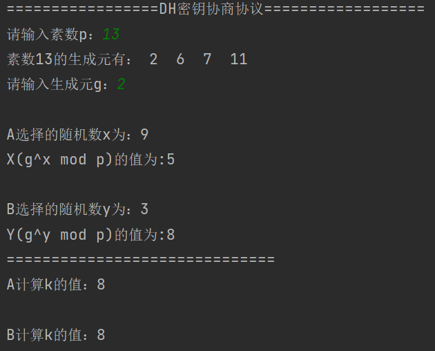  

- 实例2：素数 `p`：23  p的生成元`g`： 10

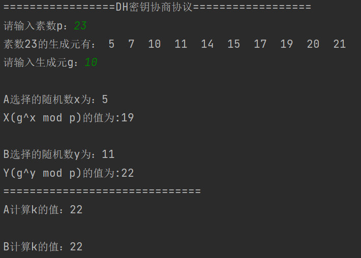

## RSA算法

- **RSA算法流程：**

1. 选择两个质数`p`和`q` ，算出他们的乘积`n = p × q `，算出对应的欧拉函数 φ(n)（利用性质φ ( n ) = φ ( p ) × φ ( q ) = ( p − 1 ) ( q − 1 )）。
2. 选择一个`e`，使得`e` < φ ( n ) 并且`e` 与φ ( n ) 互质。
3. 算出e的一个相对于φ ( n )的模反元素d。
4. `( e , n )`为公钥，`( d , n ) `为私钥，信息（明文）`m`长度小于`n`。
5. **加密**：`c` = m^e  (mod n)；
6. **解密**：`m` = c^d  (mod n)。

### 项目运行

- 下载RSA文件夹下的文件，双击打开运行RSA类

### RSA算法测试

实例：（书中例子）素数`p`：101 素数`q`：113   `e` : 3533

**运行结果：**

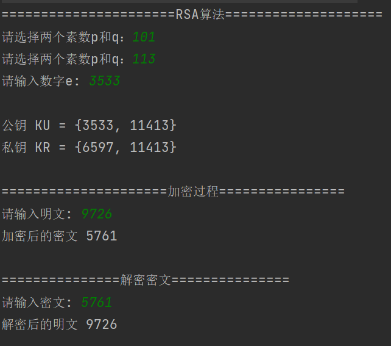

测试结果与书中一致。

## 课本习题P68

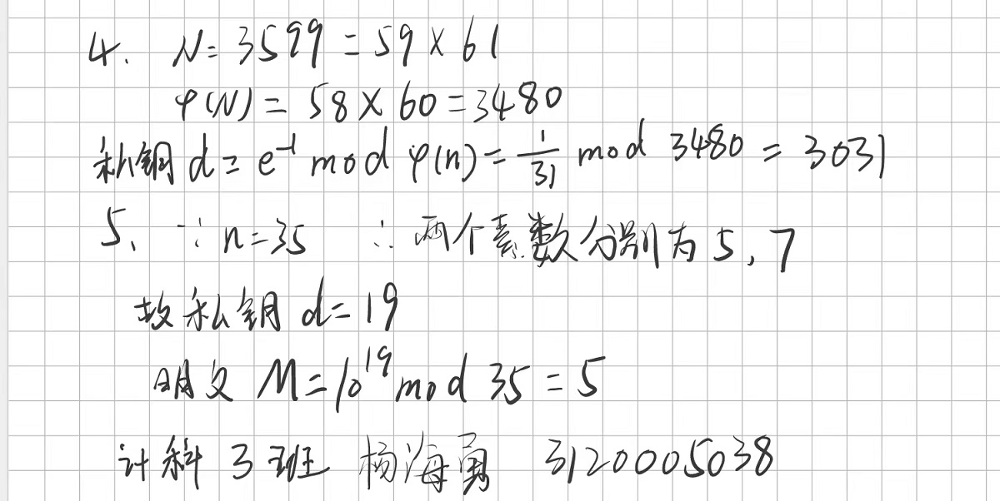

## [关于《中华人民共和国电子签名法(2019修正)》的作业](关于《中华人民共和国电子签名法(2019修正)》的作业.md)

## [PKI、SSL和IPSec配置](PKI、SSL和IPSec配置.md)
